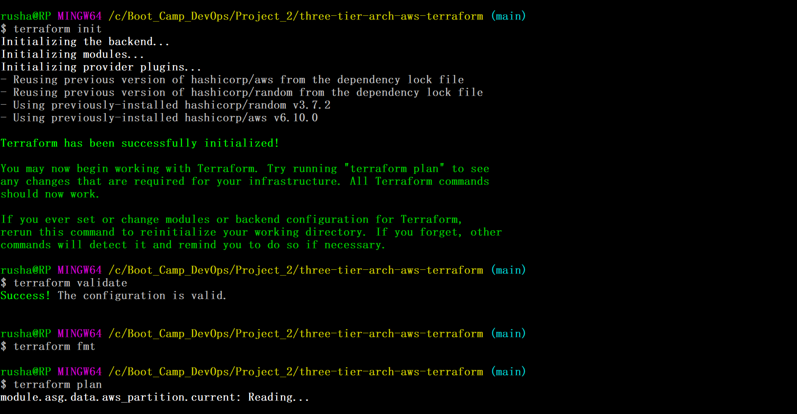
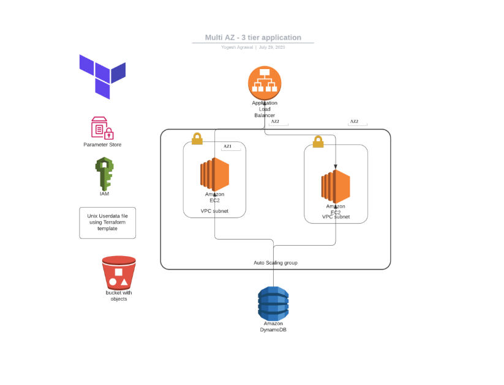
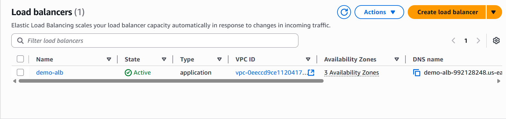
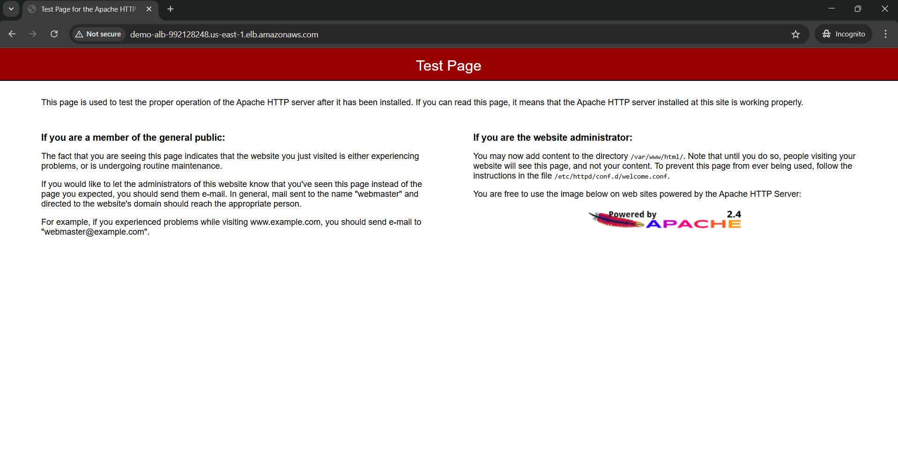
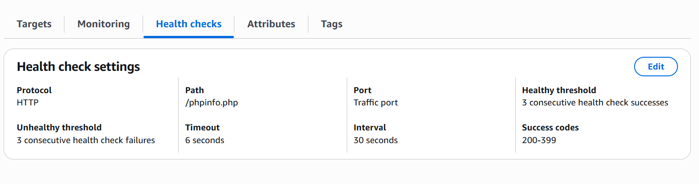
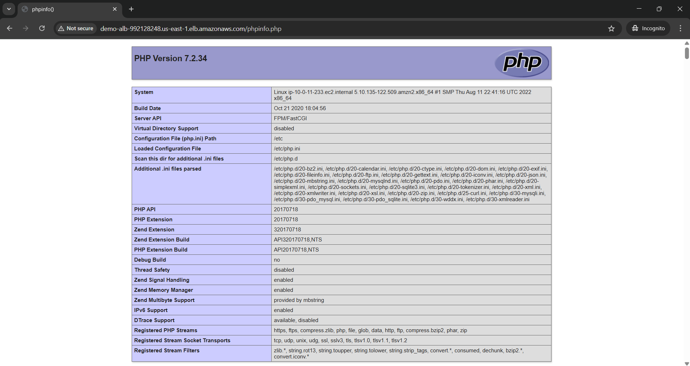
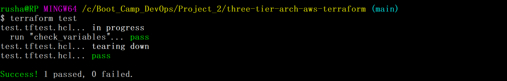
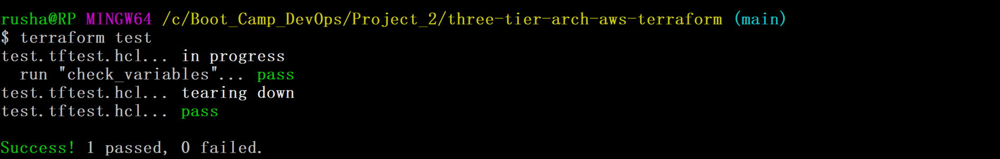

# Project 2

Creating three tier architecture using terrraform module

## Create reusable modules for VPC, security groups, RDS, EC2, and other AWS resources needed for banking applications







This is the page you can access with the load balancer DNS link



But we have our helth ceck on this path



It has active stickeyness and when we hit the path the application is displayed.



## Implement Testing Framework

Created test.tftest.hcl file where i have conducted few test dependong on few conditions.

```
run "check_variables" {
  command = apply

  # Load the tfvars file
  variables {
    region = "us-east-1"

    vpc_name             = "demo-vpc"
    vpc_cidr             = "10.0.0.0/16"
    vpc_azs              = ["us-east-1a", "us-east-1b", "us-east-1c"]
    vpc_public_subnets   = ["10.0.1.0/24", "10.0.2.0/24", "10.0.3.0/24"]
    vpc_private_subnets  = ["10.0.11.0/24", "10.0.12.0/24", "10.0.13.0/24"]
    vpc_database_subnets = ["10.0.21.0/24", "10.0.22.0/24", "10.0.23.0/24"]
  }

  # Assertions ensure variables are correctly set
  assert {
    condition     = var.region == "us-east-1"
    error_message = "Region should be us-east-1"
  }

  assert {
    condition     = length(var.vpc_azs) == 3
    error_message = "There should be exactly 3 AZs"
  }

  assert {
    condition     = var.asg_instance_type == "t3.micro"
    error_message = "ASG instance type should be t3.micro"
  }

  assert {
    condition     = var.rds_engine_version == "8.0.39"
    error_message = "RDS engine version should be 8.0.39"
  }

  assert {
    condition     = var.rds_instance_class == "db.t4g.micro"
    error_message = "RDS instance type should be db.t4g.micro"
  }

  assert {
    condition     = var.alb_http_tcp_listeners_port == 80
    error_message = "ALB listener port must be 80"
  }
}

```

This is when run = plan



This is when run = apply


